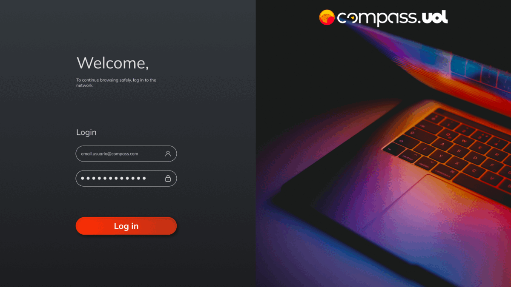

# Weekly Planner



O site Weekly Planner é um aplicativo digital desenvolvido para auxiliar os usuários na organização de suas tarefas diárias de maneira eficiente e conveniente. Com recursos intuitivos e uma interface amigável, o Planner Online facilita o gerenciamento do tempo e a priorização das atividades diárias.

Para começar a utilizar o Weekly Planner, é necessário criar uma conta no sistema. O processo de registro é simples e rápido, exigindo apenas algumas informações básicas. Após criar uma conta, os usuários terão acesso a todos os recursos e funcionalidades do Weekly Planner.

Ao fazer login, os usuários serão direcionados para uma página inicial personalizada. Nessa página, eles encontrarão uma visão geral das tarefas, além de informações úteis como o horário atual, o tempo de sua cidade, a data e o dia da semana. Esses dados são atualizados automaticamente, mantendo os usuários informados em tempo real.

Uma das características mais úteis do Weekly Planner é a organização das tarefas por dia da semana e horário. Ao criar uma nova tarefa, os usuários podem selecionar o dia e o horário em que desejam realizá-la. Essa funcionalidade permite visualizar claramente as tarefas agendadas para cada dia, ajudando os usuários a planejar seu tempo de forma eficaz.

Além disso, o sistema do Weekly Planner inclui uma validação de usuários para garantir a segurança e privacidade dos dados. Isso significa que apenas o usuário terá acesso à sua conta e às informações relacionadas a ela.

No Weekly Planner, a missão é ajudar os usuários a se tornarem mais produtivos, organizados e eficientes em suas atividades diárias. O aplicativo simplifica o gerenciamento de tarefas, permitindo que os usuários foquem no que é mais importante. Experimente o Weekly Planner agora mesmo e descubra como ele pode aprimorar sua rotina!
## Funcionalidades

- Planner de tarefas
- Atualizações do clima
- Hora atual
- Preview em tempo real
- Sistema de login
- Sistema de register
- Horário em tempo real

## Stack utilizada

**Front-end:** ReactJS
**Banco de dados** Firebase

## Requisitos antes de executar o projeto: 

**Node.js: Certifique-se de ter o Node.js instalado em seu sistema. Você pode baixá-lo em https://nodejs.org/.**

**Git: Se você ainda não o possui, você pode fazer o download em https://git-scm.com/.**

**Visual Studio Code: Recomendamos a utilização do Visual Studio Code como ambiente de desenvolvimento. Caso ainda não o tenha, você pode instalá-lo a partir do link https://code.visualstudio.com/.**


## Configuração Local

Para configurar o projeto localmente, siga estes passos:

 Clone o repositório:

```bash
 git clone https://github.com/ThiagoRuizSilva/Desafio-3-Weekly-Planner.git
```

## Navegue até o diretório do projeto:

```bash
 cd cd ./Desafio-3-Weekly-Planner/
```

## Instale as dependências:

```bash
  npm install
```

## Executar a aplicação

Para executar a aplicação, rode o seguinte comando

```bash
  npm run dev
```


